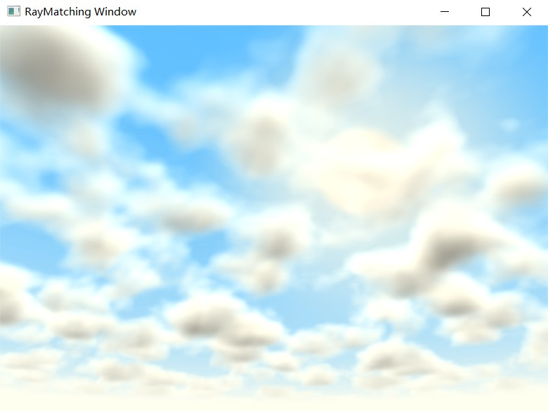

&emsp;&emsp;This project is using **Shader** to learn **RayMatching** through **DirectX11**. **Volumetric Rendering** and **3D Cloud** have been achieve. Although the effect maybe is poor ==. In addition, there are some other effect, for example, **perlin noise**, **varied color**, **turbulence texture** etc.

Thanks for [iq's shader](https://www.shadertoy.com/view/XslGRr) on the ShaderToy. I learned lots of things from this shader.

Volumetric rendering， refer to [SebH's shader](https://www.shadertoy.com/view/XlBSRz)on the ShaderToy. from this shader, I learned using VolumetricIntegration to render cloud, fog and other volumetric image.

The follow is my application cloud image:

